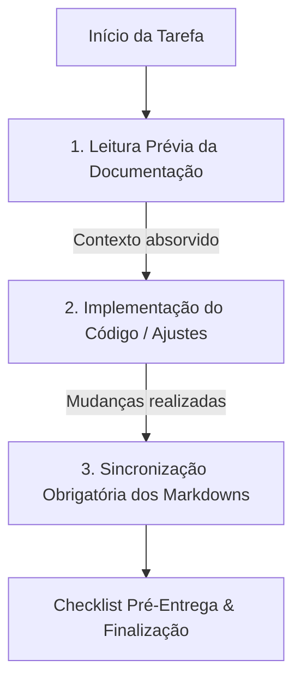

# Diretrizes para Agentes e Desenvolvedores (AGENTS.md)

Este documento estabelece as regras de conduta, padrões arquiteturais, estilo de código, tom de voz da marca e fluxo de trabalho para **agentes de Inteligência Artificial** (ex.: Antigravity, Claude Code, Cursor, Copilot) e **desenvolvedores humanos** que atuam no repositório da landing page da **Guadalupe Sistemas**.

---

## 🧭 1. Filosofia do Projeto

A landing page da Guadalupe Sistemas é projetada para ser **ultraveloz, 100% estática, acessível, otimizada para SEO e com zero fricção de manutenção**.

- **Zero-Build:** Não há etapas de compilação, empacotadores (Webpack, Vite, Rollup) ou dependências de runtime Node.js. O código que você escreve é exatamente o que roda no navegador.
- **Foco em Conversão B2B:** Cada elemento da página é pensado para construir autoridade técnica e direcionar o visitante qualificado (médicos, donos de clínicas, engenheiros) para o canal de atendimento no WhatsApp.
- **Transparência e Simplicidade:** Código legível, sem abstrações desnecessárias, priorizando padrões nativos da web (HTML5 semântico, CSS3 com variáveis nativas e Vanilla JS).

---

## 🚫 2. Regras de Ouro (Invariáveis)

Ao interagir com este repositório, o agente de IA ou desenvolvedor humano deve obedecer estritamente às seguintes regras:

1. **LEITURA PRÉVIA OBRIGATÓRIA DA DOCUMENTAÇÃO:**
   - **Antes de propor ou executar qualquer modificação no código**, consulte os documentos de contexto:
     - [`AGENTS.md`](./AGENTS.md) para regras de conduta, padrões de código e tom de voz.
     - [`SPEC.md`](./SPEC.md) para especificações técnicas, seções, tokens CSS e scripts.
     - [`DECISIONS.md`](./DECISIONS.md) para entender o histórico e as justificativas arquiteturais.
     - [`PLAN.md`](./PLAN.md) para verificar o roadmap e o backlog priorizado.
2. **SINCRONIZAÇÃO MANDATÓRIA DE DOCUMENTAÇÃO (Doc-Sync Loop):**
   - Toda alteração técnica, visual, arquitetural ou de produto **DEVE ser imediatamente sincronizada nos respectivos arquivos Markdown**. Nunca conclua uma entrega deixando a documentação desatualizada.
3. **NÃO adicione dependências de build ou frameworks JS:**
   - Não introduza React, Vue, Tailwind CSS, Sass, TypeScript ou pacotes npm sem solicitação explícita do usuário. O projeto deve continuar funcionando via simples servidor de arquivos estáticos.
4. **NÃO quebre a semântica de HTML e o SEO on-page:**
   - Preserve as tags semânticas (`<header>`, `<nav>`, `<main>`, `<section>`, `<article>`, `<footer>`).
   - Mantenha hierarquia de títulos consistente (`h1` único por página, seguido de `h2`, `h3`).
   - Não remova meta tags de SEO, tags Open Graph, tags canônicas ou blocos de dados estruturados JSON-LD (`<script type="application/ld+json">`).
5. **Mantenha os arquivos de IA e SEO sincronizados:**
   - Ao adicionar ou renomear páginas, atualize imediatamente o `sitemap.xml` e o `llms.txt`.
6. **Respeite o Design System (`css/styles.css`):**
   - Sempre utilize as variáveis CSS declaradas no `:root` (ex.: `--violet-500`, `--navy-950`, `--font-heading`, `--font-body`). Não adicione cores arbitrárias *hardcoded* ou estilos *inline*.
7. **Preserve a conformidade LGPD e Analytics:**
   - O Google Analytics (gtag.js) **nunca** deve ser carregado diretamente no `<head>` sem passar pelo controle do banner de cookies (`js/cookie-consent.js`).

---

## 🔄 3. Protocolo de Interação com a Documentação para Agentes

Todo agente de IA deve seguir o fluxo de 3 etapas em qualquer interação no projeto:



### Matriz de Sincronização Obrigatória de Markdowns

Ao efetuar alterações no projeto, identifique o gatilho e atualize obrigatoriamente o arquivo correspondente:

| Gatilho / O Que Mudou | Arquivo a Atualizar | O Que Deve Ser Atualizado |
| :--- | :--- | :--- |
| **Nova decisão técnica, mudança de arquitetura, stack ou infra** | [`DECISIONS.md`](./DECISIONS.md) | Registre o contexto, as alternativas consideradas e a justificativa da decisão no formato narrativo por tópicos. |
| **Nova rota, alteração de seções, classes CSS, tokens ou lógica JS** | [`SPEC.md`](./SPEC.md) | Atualize a especificação técnica: parâmetros de scripts, variáveis do Design System, inventário de páginas ou seções. |
| **Nova funcionalidade planejada, item concluído ou repriorização** | [`PLAN.md`](./PLAN.md) | Marque tarefas concluídas (`[x]`), adicione novos planos nas fases correspondentes e ajuste o roadmap. |
| **Criação/remoção de páginas ou alteração na proposta de valor da marca** | [`llms.txt`](./llms.txt) & [`sitemap.xml`](./sitemap.xml) | Atualize a lista de páginas e o resumo executivo para robôs de busca e modelos de IA. |
| **Mudança em diretrizes para agentes, padrões de código ou tom de voz** | [`AGENTS.md`](./AGENTS.md) | Atualize regras de conduta, convenções de código, tom de voz ou checklists. |
| **Alteração na visão geral do repositório ou estrutura de diretórios** | [`README.md`](./README.md) | Atualize a árvore de arquivos, badges ou instruções de execução local. |

---

## 💻 4. Padrões de Código

### 4.1. HTML5
- Sempre declare o atributo `lang="pt-BR"` no elemento `<html>`.
- Utilize IDs claros e semânticos em seções (ex.: `#inicio`, `#desafios`, `#diagnostico`, `#servicos`, `#casos`, `#faq`, `#formulario`), pois eles são vinculados ao *scroll-spy* e ao menu de navegação.
- Todas as imagens devem conter atributos `alt` descritivos, além de `width` e `height` quando aplicável para evitar *Cumulative Layout Shift* (CLS).
- Links externos devem utilizar `target="_blank"` acompanhado de `rel="noopener noreferrer"`.

### 4.2. CSS3
- Arquivo principal: [`css/styles.css`](file:///home/munraitoo13/Projects/guadalupesistemas-lp/css/styles.css).
- Organize os estilos pelas seções correspondentes indicadas pelos blocos de comentários no arquivo.
- Utilize nomes de classes descritivos e consistentes (ex.: `.service-card`, `.challenge-card`, `.btn-primary-violet`).
- Respeite os breakpoints responsivos padrão:
  - `@media (max-width: 1200px)` — Telas médias / notebooks pequenos.
  - `@media (max-width: 992px)` — Tablets e navegação colapsada.
  - `@media (max-width: 768px)` — Smartphones em modo retrato.
  - `@media (max-width: 480px)` — Smartphones compactos.

### 4.3. JavaScript (Vanilla)
- Arquivos: [`js/script.js`](file:///home/munraitoo13/Projects/guadalupesistemas-lp/js/script.js) (lógica interativa) e [`js/cookie-consent.js`](file:///home/munraitoo13/Projects/guadalupesistemas-lp/js/cookie-consent.js) (consentimento de privacidade).
- Programe de forma defensiva: sempre verifique se o elemento existe no DOM antes de adicionar listeners ou alterar classes/estilos (evita quebras em páginas que não contêm certas seções, como `blog.html`).
- Adicione `{ passive: true }` a ouvintes de eventos de `scroll` e `touch` para maximizar o desempenho de renderização.
- Utilize `IntersectionObserver` para animações de entrada e gatilhos de viewport, com fallback gracioso caso a API não esteja disponível.

---

## 🗣️ 5. Tom de Voz da Marca (Brand Voice & Copywriting)

Ao redigir novos textos, artigos de blog, chamadas de ação (CTAs) ou mensagens de formulário, adote as seguintes diretrizes:

### 5.1. Posicionamento
A **Guadalupe Sistemas** é uma parceira técnica séria e estratégica que entrega **diagnóstico de IA, agentes de WhatsApp, automação de processos e sistemas sob medida**. O foco é sempre o **resultado de negócio e a redução de trabalho manual**.

### 5.2. Públicos-Alvo Principais
1. **Clínicas e Consultórios:** Médicos, dentistas, veterinários e gestores de clínicas. Dores principais: no-show (faltas), sobrecarga da recepção, agendamentos fora do horário comercial, desorganização de prontuários.
2. **Empresas de Engenharia e Arquitetura:** Escritórios técnicos, construtoras e consultorias. Dores principais: busca lenta em normas/projetos, tarefas manuais repetitivas em planilhas/propostas, integração deficiente entre software técnico e CRM.
3. **Outros negócios técnicos:** Contabilidades, indústrias, comércios especializados.

### 5.3. Diretrizes de Linguagem
- **Pragmática e orientada a ROI:** Mostre números, tempo economizado e redução de falhas. Fale a língua de quem toma decisão financeira.
- **Livre de Hype ou Buzzwords Vazios:**
  - ❌ **Evite:** *"A revolução mágica da IA generativa que vai transformar exponencialmente seu ecossistema disruptivo."*
  - ✅ **Prefira:** *"Automatizamos a confirmação de consultas pelo WhatsApp para que sua recepção pare de perder 3 horas por dia e sua taxa de faltas caia pela metade."*
- **Empática e Acessível:** Reconheça que o cliente não é da área de TI e quer soluções seguras, estáveis e com suporte humanizado.
- **Ética e Transparência:** Deixar claro que na área de saúde a IA atua na parte **administrativa e de atendimento**, sem jamais substituir o julgamento clínico do profissional de saúde.

---

## 🌿 6. Diretrizes de Versionamento e Git

### 6.1. Nomenclatura de Branches
Utilize prefixos semânticos em minúsculas:
- `feat/nome-da-funcionalidade` — Novas seções, novos artigos ou recursos.
- `fix/descricao-do-bug` — Correções de layout, links quebrados ou bugs em scripts.
- `docs/descricao-da-doc` — Modificações em documentações, README ou `llms.txt`.
- `refactor/descricao` — Refatoração de CSS/JS sem alteração visual externa.
- `chore/tarefa` — Ajustes menores, atualização de assets ou configurações de deploy.

### 6.2. Padrão de Mensagens de Commit (Conventional Commits)
Escreva mensagens de commit claras e imperativas em português ou inglês:
```
<tipo>: <descrição sucinta>

[corpo opcional detalhando o motivo da alteração]
```
Exemplos:
- `feat: adiciona seção de calculadora de ROI no index`
- `fix: corrige offset de rolagem da navbar no mobile`
- `docs: adiciona especificações técnicas no SPEC.md`
- `style: ajusta espaçamento dos cards de desafios no tablet`

---

## ✅ 7. Checklist Pré-Entrega para Agentes

Antes de finalizar qualquer tarefa ou propor alterações:
- [ ] **Leitura Prévia:** A documentação (`AGENTS.md`, `SPEC.md`, `DECISIONS.md`, `PLAN.md`) foi consultada antes da implementação?
- [ ] **Sincronização de Docs:** Todos os arquivos de documentação impactados (`SPEC.md`, `DECISIONS.md`, `PLAN.md`, `llms.txt`, `sitemap.xml`, `README.md`) foram atualizados?
- [ ] **Execução e Console:** O site carrega perfeitamente via servidor local estático sem erros no console?
- [ ] **Responsividade:** O layout foi validado em viewport mobile (375px–480px) e desktop (1200px+)?
- [ ] **Links e Conversão:** Todas as âncoras e botões de CTA abrem o WhatsApp ou a seção correta?
- [ ] **Design System:** O código mantém as variáveis do Design System sem introduzir estilos *inline* desnecessários?
- [ ] **Privacidade (LGPD):** O banner de consentimento de cookies continua funcionando e o GA4 só carrega sob demanda e consentimento?
