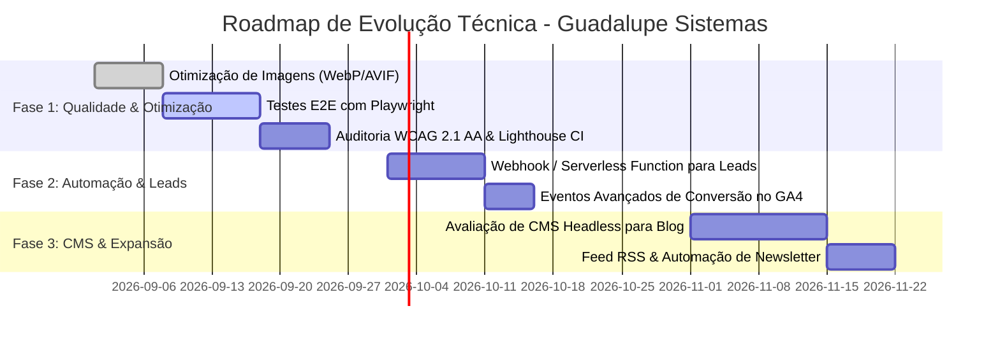

# Plano de Evolução e Roadmap Técnico (PLAN.md)

Este documento estabelece o roadmap de melhorias, frentes de engenharia e backlog priorizado para a evolução contínua da landing page da **Guadalupe Sistemas**.

---

## 🧭 Visão Estratégica

A evolução do projeto segue três princípios fundamentais:
1. **Preservar a Alta Performance:** Qualquer adição técnica não deve degradar os tempos de carregamento nem a pontuação de Core Web Vitals.
2. **Aumentar a Conversão e Retenção de Leads:** Garantir que nenhum lead qualificado seja perdido e que a mensuração de conversões seja precisa.
3. **Escalar a Produção de Conteúdo:** Permitir a publicação frequente de artigos e novidades com baixa fricção operacional.

---

## 🗺️ Roadmap de Implementação

---

## 📌 Fase 1: Performance, Acessibilidade e Testes E2E (Curto Prazo)

### 1.1. Otimização Avançada de Imagens e Ativos
- [ ] **Conversão de Formatos:** Converter imagens PNG/JPG (`assets/logo-completa.png`, `og-image.jpg`, etc.) para formatos modernos **WebP** e **AVIF**, reduzindo o peso em até 60-70%.
- [ ] **Tag `<picture>` e `srcset`:** Implementar carregamento responsivo para imagens de diferentes densidades de tela.
- [ ] **Dimensões Explícitas:** Garantir `width` e `height` definidos em todas as tags `` para zerar o CLS (*Cumulative Layout Shift*).

### 1.2. Suíte de Testes Automatizados E2E com Playwright
Implementação de testes ponta a ponta sem alterar a natureza estática do site em produção:
- [ ] **Fluxo do Formulário Multi-etapas:**
  - Validar bloqueio de avanço sem preenchimento dos campos obrigatórios.
  - Validar seleção de opções nos passos 1 e 2.
  - Validar montagem correta da URL do WhatsApp no submit final.
- [ ] **Navegação & Mobile:**
  - Validar abertura, fechamento e redirecionamento de links no menu mobile.
  - Validar funcionamento do scroll suave com offset de 80px.
- [ ] **Componentes Interativos:**
  - Validar expansão/contração exclusiva do accordion de FAQ.
  - Validar transição e parada no hover do carrossel de depoimentos.
- [ ] **Privacidade & Consentimento:**
  - Validar gravação correta de `accepted`/`rejected` no `localStorage`.
  - Validar que o script do Google Tag Manager só é inserido no DOM após consentimento.

### 1.3. Acessibilidade (WCAG 2.1 AA) e Lighthouse CI
- [ ] Adicionar atributos `aria-expanded`, `aria-controls` e `aria-label` apropriados no menu mobile e nas sanfonas de FAQ.
- [ ] Garantir navegação 100% acessível via teclado (`Tab` e `Enter`/`Space`) em todos os botões e formulários.
- [ ] Configurar workflow no GitHub Actions com **Lighthouse CI** para bloquear commits que reduzam scores abaixo de 95 em Performance, Acessibilidade, Melhores Práticas e SEO.

---

## 📌 Fase 2: Automação do Funil de Leads & Webhooks (Médio Prazo)

### 2.1. Persistência de Leads via Webhook / Serverless Function
Atualmente, se o usuário preencher o formulário mas fechar o navegador antes de clicar em "Enviar" dentro do WhatsApp Web, os dados do contato podem ser perdidos.

- [ ] **Implementação:**
  - Criar uma Serverless Function leve na Vercel (`/api/lead`) ou disparar uma requisição assíncrona via `fetch` para um webhook seguro (ex.: n8n, Supabase ou CRM).
  - No evento de submit do formulário:
    1. Envia os dados do formulário silenciosamente via `fetch` em background para o webhook.
    2. Imediatamente após (ou em paralelo), abre a aba do WhatsApp com a mensagem pronta.
  - **Resultado:** Retenção de 100% dos contatos gerados no site, permitindo follow-up ativo mesmo se o lead desistir do WhatsApp.

### 2.2. Métricas Avançadas de Conversão no GA4
- [x] **Camada de eventos implementada** em `js/analytics.js` (agosto/2026). Os nomes adotados seguem o padrão recomendado do GA4 em vez dos propostos originalmente aqui — `generate_lead` já vem com relatórios prontos, enquanto um nome personalizado exigiria configuração manual sem ganho. Ver decisão 9 em [`DECISIONS.md`](./DECISIONS.md).

  | Proposto neste plano | Implementado |
  | :--- | :--- |
  | `form_step_1_selected` | `form_step_1` |
  | `form_step_2_filled` | `form_step_2` |
  | `lead_converted_whatsapp` | `generate_lead` |

  Além desses: `scroll_90`, `click_whatsapp`, `click_diagnostico`, `click_case`, `blog_article_view`, `form_start`.
- [x] **Consent Mode v2** declarado antes de qualquer tag do Google.
- [x] **Origem do lead no WhatsApp:** todo link `wa.me` assinado com a página de origem; UTM da sessão persistidos.
- [ ] **Registrar `page_group` como dimensão personalizada** no painel do GA4 — sem isso a dimensão não aparece nos relatórios.
- [ ] **Marcar `generate_lead` e `click_whatsapp` como eventos-chave** no GA4.
- [ ] **Criar o container do GTM** e preencher `GTM_ID` em `js/cookie-consent.js` (hoje vazio; o site funciona só com GA4).
- [ ] **Verificar o domínio no Google Search Console** e enviar o `sitemap.xml`.
- [ ] Criar funil de conversão personalizado no painel do Google Analytics 4.

> Passo a passo completo em [`docs/analytics.md`](./docs/analytics.md).

---

## 📌 Fase 3: Expansão do Blog com CMS Headless (Longo Prazo)

### 3.1. Gestão Dinâmica de Conteúdo para o Blog
Conforme a frequência de publicação de artigos sobre IA, segurança e automação aumentar, a criação manual de arquivos HTML (`7-motivos...html`, `seguranca...html`) pode se tornar repetitiva.

> **Atualização de agosto/2026:** a fricção prevista aqui foi parcialmente resolvida sem CMS. Artigos agora seguem `blog/<slug>/index.html` a partir de um template documentado (seção 7 do [`SPEC.md`](./SPEC.md)), com `partials/` cuidando de nav e footer e `tools/build-sitemap.mjs` gerando o sitemap. A avaliação de CMS continua válida caso a frequência de publicação aumente muito, mas deixou de ser urgente.

- [ ] **Avaliação de Opções de CMS:**
  - **Opção A (Git-based / Zero Backend):** Decap CMS (antigo Netlify CMS) ou TinaCMS salvando arquivos Markdown diretamente no repositório GitHub.
  - **Opção B (Headless leve):** Hygraph, Strapi ou Notion API consumido via build estático leve (ex.: Astro).
- [ ] **Feed RSS:** Gerar automaticamente `feed.xml` para distribuição de conteúdo em leitores de RSS e canais de automação.

### 3.2. Internacionalização (i18n)
- [ ] Se houver demanda para atender clientes fora do Brasil (ex.: América Latina ou EUA):
  - Estruturação de rotas de idioma (`/en/`, `/es/`).
  - Ajuste de tags `hreflang` e sitemaps multilíngues.

---

## ✅ Concluído: Reestruturação de Arquitetura e SEO (Agosto/2026)

Execução das Fases 1 e 2 da auditoria pública de 25/08/2026. O site saiu de 5 para 24 URLs.

### Correções críticas
- [x] Os 3 cards de artigos da home apontavam para `href="#"` e o clique era inerte — `js/script.js` faz early-return em `'#'`. Hoje levam a artigos reais.
- [x] Contadores exibiam `0` para qualquer leitura sem JavaScript. O valor final passou para o HTML.
- [x] Depoimentos assinados por "Cliente Satisfeito" com fotos de banco de imagem foram despersonalizados. Nenhuma foto de stock representa pessoas da empresa.
- [x] CTAs padronizados e todos os links internos convertidos para caminhos absolutos.
- [x] `title`, `meta description` e `canonical` próprios e únicos nas 24 páginas.

### Páginas criadas
- [x] Verticais `/para-clinicas/` e `/para-engenharia/`
- [x] `/diagnostico-de-ia/`
- [x] `/solucoes/` e as 5 páginas de solução
- [x] `/casos/` e os 3 casos detalhados
- [x] `/sobre/`, `/contato/`, `/seguranca-e-lgpd/`
- [x] Blog migrado para URLs em pasta, com 3 artigos novos

### Infraestrutura
- [x] `partials/` como fonte única de nav e footer, com `tools/sync-layout.mjs`
- [x] Verificadores `check-links`, `check-seo`, `check-quality` e `build-sitemap`
- [x] `vercel.json` com 301 das URLs antigas, headers de segurança e cache
- [x] `.vercelignore` excluindo `partials/`, `tools/` e `docs/` do publish

### Pendente de dados do cliente
- [ ] Resolver os marcadores `<!-- TODO -->`, concentrados nas páginas de caso (porte, região, prazo, números antes/depois) e em `/seguranca-e-lgpd/` (8 confirmações técnicas: backup, criptografia, retenção, subprocessadores).
- [ ] Substituir os relatos por depoimentos nominais, com autorização de uso de imagem.
- [ ] Criar imagem de capa própria para cada artigo — hoje todos usam a imagem de marca.

---

## ✅ Concluído: Fase 3 de SEO — Clusters, Categorias e SEO Local (Agosto/2026)

Execução da segunda auditoria de SEO. O site saiu de 24 para **37 URLs**.

### Home
- [x] H1 trocado de promessa comercial ("Automação e IA para eliminar tarefas repetitivas") para definição de entidade: **"IA, automação e sistemas sob medida para empresas"**.
- [x] Subtítulo nomeia a empresa e cobre as três categorias de busca.
- [x] `title`, `og:title`, `twitter:title` e as três descriptions realinhados, incluindo "desenvolvimento de sistemas" e "inteligência artificial".
- [x] `Organization` virou `ProfessionalService` com `areaServed` explícito.

### Páginas-pilar criadas
- [x] `/inteligencia-artificial-para-empresas/`
- [x] `/desenvolvimento-de-sistemas/`
- [x] `/automacao-de-whatsapp/`
- [x] `/quanto-custa-um-sistema-personalizado/`
- [x] `/automacao-e-sistemas-em-minas-gerais/`

**Não foram criadas** as URLs de raiz sugeridas na auditoria (`/agentes-de-ia/`, `/automacao-de-processos/`, `/sistemas-sob-medida/`, `/aplicativos/`, `/solucoes-para-clinicas/`): já existem sob `/solucoes/*` e `/para-clinicas/`, e duplicá-las geraria canibalização. Ver decisão 11 em [`DECISIONS.md`](./DECISIONS.md).

### Reforço semântico
- [x] Um `<h2>` de cobertura de termo e duas perguntas de FAQ em cada uma das 5 páginas de solução e nas 2 verticais, com o `FAQPage` espelhado.
- [x] `/solucoes/` ganhou o card de automação de WhatsApp e uma seção com as três páginas de categoria.

### SEO local
- [x] Região de atendimento no rodapé (`partials/footer.html`, propagado às 37 páginas) e em `/contato/`.
- [x] `ProfessionalService` com `areaServed` na home, nas páginas de categoria e na página regional.

### Evidência dos números
- [x] Cada contador de `#resultados` linka o caso que o originou.
- [x] Bloco "Como esse número foi medido" nas 3 páginas de caso, dizendo o que é verificável e deixando período e base de cálculo em `<!-- TODO -->`.

### Conteúdo — 8 artigos novos
- [x] Cluster Automação: `o-que-e-automacao-de-processos`, `processos-que-sua-empresa-pode-automatizar`, `como-calcular-roi-de-uma-automacao`, `automacao-substitui-funcionarios`
- [x] Cluster IA: `como-usar-ia-na-sua-empresa`, `quanto-custa-implementar-ia-em-uma-empresa`
- [x] Cluster Sistemas: `como-escolher-empresa-de-desenvolvimento-de-sistemas`, `como-transformar-planilha-em-sistema`

O artigo "Sistema próprio ou software pronto?", previsto no plano original, foi **substituído** por "Como escolher uma empresa de desenvolvimento de sistemas": a comparação pronto × sob medida já é o miolo de `/blog/quando-investir-em-sistema-proprio/`, e publicar os dois criaria concorrência interna pela mesma busca.

---

## 📌 Fase 4: Cluster de Inteligência Artificial (Próxima)

Títulos definidos, conteúdo a escrever. Todos linkam `/inteligencia-artificial-para-empresas/` no meio do texto e recebem link de volta pelo "Veja também" do pilar.

- [ ] IA para atendimento: o que muda na prática
- [ ] IA para vendas e follow-up
- [ ] IA para clínicas: o que é permitido e o que não é
- [ ] IA para engenharia: normas, propostas e acervo técnico
- [ ] IA para análise de documentos
- [ ] Como criar um agente de IA para a sua empresa
- [ ] Assistente de IA empresarial: o que é e para que serve
- [ ] IA generativa para empresas, sem hype
- [ ] Automação com ChatGPT: até onde vai e onde para
- [ ] IA para pequenas empresas: o que cabe no orçamento
- [ ] Como treinar uma IA com os documentos da sua empresa
- [ ] Os riscos de usar IA sem política interna

## 📌 Fase 5: Cluster de Automação e Sistemas

- [ ] Automação de processos: guia completo para empresas (consolidação do cluster)
- [ ] Quanto custa automatizar uma empresa
- [ ] Automação de WhatsApp vale a pena?
- [ ] Automação comercial: do lead ao fechamento
- [ ] Automação financeira: conciliação e fechamento
- [ ] Automação de cobrança sem desgastar o cliente
- [ ] Automação de documentos e assinaturas
- [ ] Como desenvolver um sistema de gestão
- [ ] Sistema personalizado para pequenas empresas
- [ ] Sistema web personalizado: quando o navegador basta
- [ ] Desenvolvimento de software empresarial: como funciona um projeto
- [ ] Como substituir vários sistemas por um só

## 📌 Fase 6: SEO Local por Cidade (Bloqueada por dados reais)

Só executar quando houver **cliente real na cidade para citar** e conteúdo genuinamente diferente por página. Página "cidade + palavra-chave" praticamente igual às outras é conteúdo artificial e viola a regra 10 do `DECISIONS.md`.

- [ ] Confirmar a cidade-sede da empresa (hoje `<!-- TODO -->` em `/sobre/`, `/contato/`, na home e na página regional — o JSON-LD `ProfessionalService` está sem `address`)
- [ ] Criar o **Google Business Profile** e vincular ao site
- [ ] Definir em quais cidades há atuação real: Itapecerica, Divinópolis, Formiga, Pará de Minas, Itaúna, Santo Antônio do Monte, Nova Serrana
- [ ] Só então criar as páginas por cidade, cada uma com empresas atendidas, problemas típicos da região, projetos reais, FAQ e contato

## 📌 Pendências de dados para a Fase 3

- [ ] **Faixas de investimento por porte de projeto**, para `/quanto-custa-um-sistema-personalizado/`. Hoje a página publica só o valor confirmado do diagnóstico (a partir de R$ 2.500) e explica o método de orçamento, sem cifra de projeto.
- [ ] **Metodologia dos números dos casos:** período comparado, base de cálculo e quem mediu, para os três blocos "Como esse número foi medido".
