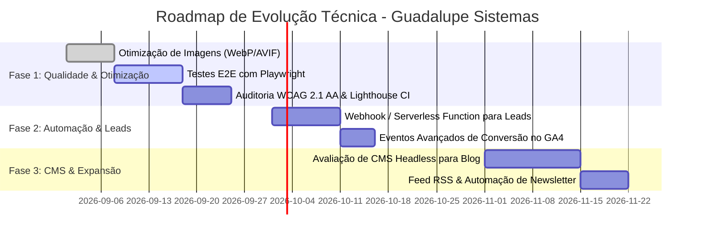

# Plano de Evolução e Roadmap Técnico (PLAN.md)

Este documento estabelece o roadmap de melhorias, frentes de engenharia e backlog priorizado para a evolução contínua da landing page da **Guadalupe Sistemas**.

---

## 🧭 Visão Estratégica

A evolução do projeto segue três princípios fundamentais:
1. **Preservar a Alta Performance:** Qualquer adição técnica não deve degradar os tempos de carregamento nem a pontuação de Core Web Vitals.
2. **Aumentar a Conversão e Retenção de Leads:** Garantir que nenhum lead qualificado seja perdido e que a mensuração de conversões seja precisa.
3. **Escalar a Produção de Conteúdo:** Permitir a publicação frequente de artigos e novidades com baixa fricção operacional.

---

## 🗺️ Roadmap de Implementação

---

## 📌 Fase 1: Performance, Acessibilidade e Testes E2E (Curto Prazo)

### 1.1. Otimização Avançada de Imagens e Ativos
- [ ] **Conversão de Formatos:** Converter imagens PNG/JPG (`assets/logo-completa.png`, `og-image.jpg`, etc.) para formatos modernos **WebP** e **AVIF**, reduzindo o peso em até 60-70%.
- [ ] **Tag `<picture>` e `srcset`:** Implementar carregamento responsivo para imagens de diferentes densidades de tela.
- [ ] **Dimensões Explícitas:** Garantir `width` e `height` definidos em todas as tags `` para zerar o CLS (*Cumulative Layout Shift*).

### 1.2. Suíte de Testes Automatizados E2E com Playwright
Implementação de testes ponta a ponta sem alterar a natureza estática do site em produção:
- [ ] **Fluxo do Formulário Multi-etapas:**
  - Validar bloqueio de avanço sem preenchimento dos campos obrigatórios.
  - Validar seleção de opções nos passos 1 e 2.
  - Validar montagem correta da URL do WhatsApp no submit final.
- [ ] **Navegação & Mobile:**
  - Validar abertura, fechamento e redirecionamento de links no menu mobile.
  - Validar funcionamento do scroll suave com offset de 80px.
- [ ] **Componentes Interativos:**
  - Validar expansão/contração exclusiva do accordion de FAQ.
  - Validar transição e parada no hover do carrossel de depoimentos.
- [ ] **Privacidade & Consentimento:**
  - Validar gravação correta de `accepted`/`rejected` no `localStorage`.
  - Validar que o script do Google Tag Manager só é inserido no DOM após consentimento.

### 1.3. Acessibilidade (WCAG 2.1 AA) e Lighthouse CI
- [ ] Adicionar atributos `aria-expanded`, `aria-controls` e `aria-label` apropriados no menu mobile e nas sanfonas de FAQ.
- [ ] Garantir navegação 100% acessível via teclado (`Tab` e `Enter`/`Space`) em todos os botões e formulários.
- [ ] Configurar workflow no GitHub Actions com **Lighthouse CI** para bloquear commits que reduzam scores abaixo de 95 em Performance, Acessibilidade, Melhores Práticas e SEO.

---

## 📌 Fase 2: Automação do Funil de Leads & Webhooks (Médio Prazo)

### 2.1. Persistência de Leads via Webhook / Serverless Function
Atualmente, se o usuário preencher o formulário mas fechar o navegador antes de clicar em "Enviar" dentro do WhatsApp Web, os dados do contato podem ser perdidos.

- [ ] **Implementação:**
  - Criar uma Serverless Function leve na Vercel (`/api/lead`) ou disparar uma requisição assíncrona via `fetch` para um webhook seguro (ex.: n8n, Supabase ou CRM).
  - No evento de submit do formulário:
    1. Envia os dados do formulário silenciosamente via `fetch` em background para o webhook.
    2. Imediatamente após (ou em paralelo), abre a aba do WhatsApp com a mensagem pronta.
  - **Resultado:** Retenção de 100% dos contatos gerados no site, permitindo follow-up ativo mesmo se o lead desistir do WhatsApp.

### 2.2. Métricas Avançadas de Conversão no GA4
- [ ] Disparar eventos customizados de funil:
  - `form_step_1_selected` (solução escolhida)
  - `form_step_2_filled` (dor descrita)
  - `lead_converted_whatsapp` (redirecionamento com sucesso)
- [ ] Criar funil de conversão personalizado no painel do Google Analytics 4.

---

## 📌 Fase 3: Expansão do Blog com CMS Headless (Longo Prazo)

### 3.1. Gestão Dinâmica de Conteúdo para o Blog
Conforme a frequência de publicação de artigos sobre IA, segurança e automação aumentar, a criação manual de arquivos HTML (`7-motivos...html`, `seguranca...html`) pode se tornar repetitiva.

- [ ] **Avaliação de Opções de CMS:**
  - **Opção A (Git-based / Zero Backend):** Decap CMS (antigo Netlify CMS) ou TinaCMS salvando arquivos Markdown diretamente no repositório GitHub.
  - **Opção B (Headless leve):** Hygraph, Strapi ou Notion API consumido via build estático leve (ex.: Astro).
- [ ] **Feed RSS:** Gerar automaticamente `feed.xml` para distribuição de conteúdo em leitores de RSS e canais de automação.

### 3.2. Internacionalização (i18n)
- [ ] Se houver demanda para atender clientes fora do Brasil (ex.: América Latina ou EUA):
  - Estruturação de rotas de idioma (`/en/`, `/es/`).
  - Ajuste de tags `hreflang` e sitemaps multilíngues.
